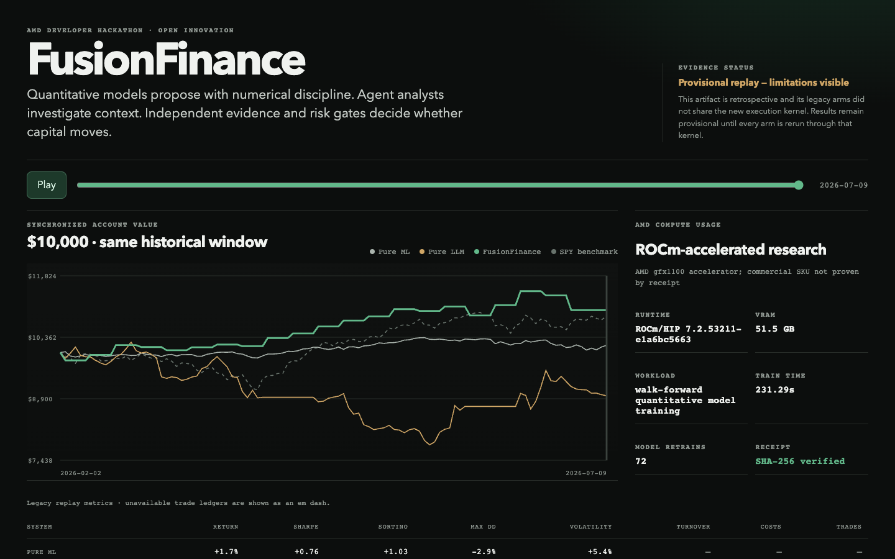

# FusionFinance

**Quantitative discipline meets agentic investigation—with evidence and risk gates between language and capital.**

[](LICENSE)
[](pyproject.toml)
[](https://fusionfinance2.vercel.app)

FusionFinance is an auditable autonomous-trading research system. Quantitative
ML proposes opportunities. Agent roles investigate context and falsifiers. A
deterministic evidence gate challenges citations and numbers. An independent
market verifier and portfolio-risk layer are the required downstream capital
gates. The checked-in agent runtime stops at a sealed evidence precheck; it does
not claim that the full capital path is wired end to end.

> **ML proposes. Agents investigate. Evidence challenges. Risk decides.**

**[Open the no-auth demo](https://fusionfinance2.vercel.app)** ·
**[View the public repository](https://github.com/FusionCube18712/FusionFinance)**



Research and paper-trading software only. Not financial advice, a profit
guarantee, or an authorization for real-money execution.

## The experiment

The system defines three distinct arms under one intended experiment contract:

| Arm | Inputs | What it tests |
|---|---|---|
| Pure ML | Structured point-in-time market and filing features | Numerical consistency without narrative interpretation |
| Pure LLM | Agent research without the proprietary ML proposal | Context synthesis without quantitative calibration |
| FusionFinance | ML proposal, agent investigation, evidence and market verification, risk sizing | Whether defined checks improve decision quality |

FusionFinance is not a vote or an average. A fluent thesis can be rejected, and
a strong model score can remain untraded. The current Micron example does
exactly that: the proposal schema passes, but the retrospective thesis lacks a
prospective seal and citation-complete evidence, so the final action is
`rejected` with a zero position.

The shared execution foundation freezes the universe, market clock, capital,
costs, slippage, rebalance cadence, leverage, and position limits in
[`configs/fusionfinance-demo.json`](configs/fusionfinance-demo.json). It is
tested infrastructure for the next controlled run; it is not the provenance of
the legacy replay shown below.

## Current replay—useful, but provisional

The public February–July 2026 replay contains 109 stored observations and 12
visible rejected decisions. Metrics are recomputed from the checked-in curves:

| Stored arm | Return | Sharpe | Sortino | Max drawdown | Volatility |
|---|---:|---:|---:|---:|---:|
| Pure ML | +1.7% | +0.76 | +1.03 | −2.9% | 5.4% |
| Pure LLM | −10.3% | −0.90 | −1.28 | −23.8% | 24.5% |
| Legacy Fusion line | +10.1% | +2.05 | +3.48 | −3.9% | 11.1% |
| SPY benchmark | +8.7% | +1.39 | +2.10 | −8.9% | 14.6% |

These numbers are **provisional, not causal proof of fusion outperformance**.
The legacy arms were not produced by the new shared execution kernel, their
historical LLM theses were not prospectively sealed, and those theses fail the
current evidence contract. The replay demonstrates the product, metric
pipeline, verifier behavior, and claim boundary—not universal alpha.

The legacy Fusion curve is also sampled differently: it contains only 21
nonzero changes across 109 stored account values, in an apparent five-session
marking cadence, while the comparison arms change more frequently. That sparse
cadence can hide intra-interval troughs and weakens cross-arm drawdown
comparability.

Turnover, cost, exposure, cash, win rate, and trade count are shown as an em
dash because the legacy trade ledger was not retained. The dash means
**unavailable**, not zero trades.

## Judge quickstart

The default demo is static, fast, and offline. It needs no login, API key,
model endpoint, or market-data connection. Python 3.11+ runs the reproducibility
suite; FFmpeg's `ffprobe` validates the checked-in release video.

```bash
# Instant judge path
python3 -m http.server 8000 --bind 127.0.0.1 --directory demo
# Open http://127.0.0.1:8000/index.html

# Reproducibility and tests
python3 -m venv .venv
. .venv/bin/activate
python -m pip install -e '.[dev]'
make artifacts
make verify
make test
```

The artifact build reads only checked-in files under [`evidence/`](evidence/).
It performs no network request and uses no private cache. Running it twice
produces byte-identical public artifacts.

The judge path also includes a real provider-agnostic analyst runtime under
[`alpha/agents/`](alpha/agents/). Market, news, fundamentals, and risk roles
run concurrently against one hash-sealed source snapshot. The default provider
is deterministic and offline; an optional OpenAI-compatible adapter uses only
the Python standard library and environment variables. Both paths must emit the
same strict JSON contract before an immutable thesis can reach the existing
evidence audit and veto-first candidate decision. Sources newer than the
proposal cutoff are rejected before any role sees them, and quantitative claims
must use reconciled citation fields:

```bash
pytest -q tests/test_agent_runtime.py -p no:capture
```

The focused test runs unseen structured fixtures through approval, malformed
output, unknown-citation, contradiction, and risk-veto paths. It does not
retroactively turn the legacy replay into a prospective agent run.

The receipt is explicitly an `agent_evidence_precheck`. It proves schema,
point-in-time, citation, numeric-reconciliation, and decision self-consistency;
it does not prove semantic entailment, authenticity, market-verifier approval,
portfolio construction, or execution. Its `provisional_weight_cap` is not an
executable target; those remain separate downstream gates. The current receipt embeds
the immutable proposal and source snapshot, then rederives their hashes,
evidence audit, decision, reasons, and provisional cap during validation.

## Architecture

```text
Point-in-time data
       │
       ├── Pure ML ───────────────────────────────────────────┐
       ├── Pure LLM agent roles ──────────────────────────────┤
       └── ML proposal → agents → evidence audit             │
                                  → market verifier           ├→ shared execution → metrics
                                  → risk sizing ──────────────┘
```

- [`alpha/filing_alpha/`](alpha/filing_alpha/) contains attributed XBRL,
  filing-text, point-in-time fusion, and evaluation transforms selected from
  the supplied `filing_alpha_sharpe6` archive. Its rejected strategy and unsafe
  timestamp parser were not imported.
- [`alpha/agents/`](alpha/agents/) contains the four-role concurrent desk,
  deterministic offline and optional HTTP providers, strict immutable input and
  output contracts, and the agent/evidence pre-gate orchestrator. The market
  verifier, portfolio policy, and execution remain downstream.
- [`alpha/verifier/`](alpha/verifier/) defines immutable theses, exact-quote and
  numeric reconciliation, source-availability checks, calibration, market
  verification, and veto-first adjudication.
- [`demo/`](demo/) contains the immutable experiment contracts, common
  next-session execution/metrics kernel, and the deployed replay interface.
- [`evidence/`](evidence/) is the complete public rebuild input and AMD receipt
  chain.

See [architecture](docs/architecture.md), [methodology](docs/methodology.md),
and [limitations](docs/limitations.md) for the implemented boundary and the
work still required before a comparative claim.

## AMD Compute Usage

AMD compute powers a recorded expanding walk-forward quantitative model
training workload—not a decorative logo. This workload is separate from and
did not generate the displayed legacy replay curves. Self-reported receipts
record:

- AMD vendor and `gfx1100` architecture;
- PyTorch on ROCm/HIP `7.2.53211-e1a6bc5663`;
- 51,522,830,336 reported VRAM bytes;
- 72 expanding walk-forward ranker retrains; and
- 231.29 seconds of recorded GPU training.

The builder derives those fields from the receipt contents and cross-checks the
environment, hardware, and training records. SHA-256 protects their published
byte integrity; it is not independent hardware attestation. The raw device-name
field and utilization are unavailable, so FusionFinance does not invent an exact
commercial SKU or utilization value. Verify the published chain locally:

```bash
python3 scripts/verify_amd.py
```

Full evidence and caveats: [AMD Compute Usage](docs/amd-compute.md).

## Submission artifacts

- [Live replay](https://fusionfinance2.vercel.app)
- [Demo video](presentation/FusionFinance_Demo.mp4)
- [10-page slide deck](presentation/FusionFinance_Submission.pdf)
- [Timed video storyboard](presentation/video-storyboard.json) and
  [narration](presentation/video-script.md)
- [Replay result](results/demo_run.json), [metrics](results/metrics.json),
  [decisions](results/decisions.jsonl), and
  [AMD manifest](results/amd_compute.json)
- [Submission copy and checklist](docs/SUBMISSION_PACKAGE.md)

## Repository map

```text
alpha/          focused filing, agent, verifier, and AMD-backed quantitative modules
configs/        frozen controlled-comparison contract
demo/           no-auth UI plus shared execution and metrics kernel
docs/           architecture, methodology, AMD evidence, and limitations
evidence/       sealed replay input and three byte-preserved AMD receipts
presentation/   submitted deck/video sources and artifacts
results/        deterministic public outputs
scripts/        artifact builder, AMD verifier, and curated archive builder
tests/          focused unit, integration, publication, and release tests
```

The public tree intentionally excludes vendored research archives, obsolete
demo surfaces, private caches, fine-tuning corpora, raw portrait/voice media,
and historical experiment operators. The project acknowledges external ideas
through links and notices instead of shipping unused upstream repositories.

## License and attribution

Original FusionFinance work is licensed under
[GPL-3.0-only](LICENSE). The filing-alpha subset retains its MIT notice in
[`alpha/filing_alpha/NOTICE`](alpha/filing_alpha/NOTICE). See [NOTICE](NOTICE)
for attribution and boundaries.
